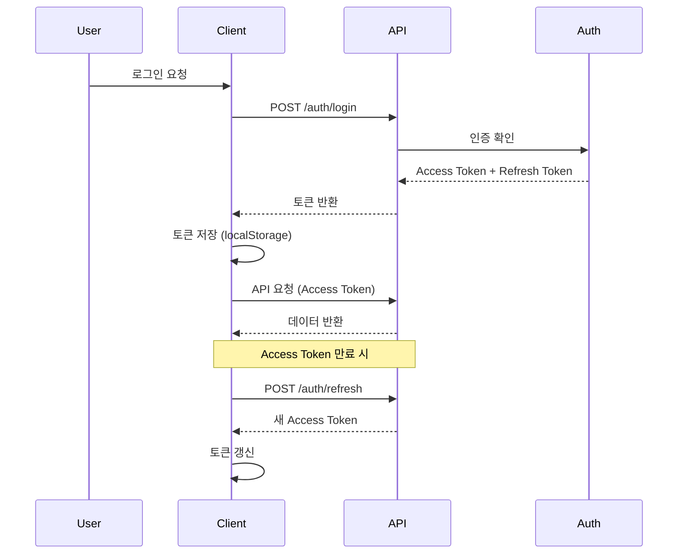

# Git 커밋 메시지 작성 규칙

> **중요**: 모든 커밋 메시지는 한글로 작성합니다.

## 작성 전 체크리스트

1. 변경 사항을 먼저 검토합니다
2. 문제가 되는 이슈가 있다면 지적하고 해결합니다
3. 커밋 메시지 작성 시 충분히 고민합니다 (ultrathink!)

## 커밋 메시지 포맷

```
<type>: <subject>

<body>

# 상세 설명
<detailed explanation of changes>
```

### 여러 변경사항이 있는 경우
- 변경 사항이 많으면 **테이블 형식**으로 가독성을 높입니다
- 변경 흐름이 있으면 **Mermaid 다이어그램**을 추가합니다

---

## 커밋 타입 (Type)

| 타입 | 설명 |
|------|------|
| `feat` | 새로운 기능 추가 |
| `fix` | 버그 수정 |
| `docs` | 문서 수정 |
| `style` | 코드 포맷팅, 세미콜론 누락, 코드 변경이 없는 경우 |
| `refactor` | 코드 리팩토링 |
| `test` | 테스트 코드, 리팩토링 테스트 코드 추가 |
| `chore` | 빌드 업무 수정, 패키지 매니저 수정 |

---

## 제목 (Subject) 작성 규칙

- ✅ 변경 사항에 대한 **간단한 설명**
- ✅ **50자 이내**로 작성
- ✅ **마침표 없이** 작성
- ✅ **현재 시제** 사용

---

## 본문 (Body) 작성 규칙

- **무엇을, 왜** 변경했는지 설명 (어떻게 보다는 목적 중심)
- 여러 줄의 메시지를 작성할 때는 **"-"로 구분**
- 변경된 항목을 나열

---

## 상세 변경사항 (Detailed Explanation) 작성 규칙

### 1. 배경 설명
- 변경해야 했던 **배경**을 파악할 수 있다면 설명 첨부

### 2. 코드 변경 설명
- 변경 사항에 대해 **코드의 diff** 등을 통해 설명 첨부
- 복잡한 변경사항은 **표** 형식으로 정리
- 흐름이 있는 변경사항은 **Mermaid 다이어그램** 추가

---

## 커밋 메시지 작성 예시

### 예시 1: 기본 형식

```
feat: 사용자 프로필 수정 및 그룹 멤버 목록 정렬 기능 추가

- 사용자 편집 모달에 프로필 수정 기능 추가 (이름, 이메일, 학번)
- 그룹 멤버 목록에 정렬 기능 추가 (이름, 학번, 레벨, 역할)
- Member 인터페이스를 MemberListItem으로 개선하고 정렬 관련 필드 추가

# 상세 설명

## 프로필 수정 기능
- react-hook-form을 사용한 입력값 유효성 검사 구현
  - 이름: 필수 입력, 2자 이상
  - 이메일: 필수 입력, 이메일 형식 검증
  - 학번: 선택 입력, 10자리 숫자 형식 검증
- 수정 중 로딩 상태 표시 및 에러 처리 추가

## 멤버 목록 정렬 기능
- 정렬 가능한 컬럼에 정렬 버튼 추가
- 정렬 상태에 따른 시각적 피드백 (화살표) 구현
- API 요청에 정렬 파라미터 추가 (sort, sortBy)

## 타입 및 UI 개선
- Member -> MemberListItem으로 이름 변경 및 필드 추가 (level.id, role)
- 멀티 역할 툴팁 제거하고 최고 권한 역할만 표시하도록 단순화
```

### 예시 2: 테이블 형식 사용

```
refactor: 대시보드 컴포넌트 구조 개선

- 중복 코드 제거 및 재사용 가능한 컴포넌트로 분리
- 상태 관리 로직 개선

# 상세 설명

## 변경된 파일

| 파일 | 변경 내용 |
|------|-----------|
| `Dashboard.tsx` | 메인 대시보드 로직 분리, 차트 컴포넌트 import |
| `MetricsCard.tsx` | 새로 생성, 지표 카드 공통 컴포넌트 |
| `ChartWrapper.tsx` | 새로 생성, 차트 래퍼 컴포넌트 |
| `hooks/useDashboard.ts` | 새로 생성, 대시보드 상태 관리 훅 |

## 개선 효과
- 코드 중복 60% 감소
- 컴포넌트 재사용성 향상
- 유지보수 용이성 증가
```

### 예시 3: Mermaid 다이어그램 포함

```
feat: 사용자 인증 플로우 개선

- JWT 토큰 기반 인증으로 변경
- 리프레시 토큰 자동 갱신 로직 추가
- 로그인 상태 유지 기능 구현

# 상세 설명

## 인증 플로우



## 주요 변경사항
- AuthContext에 토큰 갱신 로직 추가
- API 인터셉터에서 401 에러 시 자동 토큰 갱신
- 로그인 상태 유지를 위한 localStorage 사용
```

---

## 중요 원칙

### ✅ DO (권장사항)
- 변경 사항을 **하나로 합쳐서** 커밋 메시지 작성
- **무엇을, 왜** 변경했는지 명확히 설명
- 복잡한 내용은 **표나 다이어그램** 활용
- 코드 리뷰어가 이해하기 쉽게 작성

### ❌ DON'T (피해야 할 사항)
- 너무 간략한 메시지 (예: "수정", "버그 픽스")
- 변경 사항을 여러 개의 커밋으로 쪼개기
- 영어와 한글 혼용
- "어떻게" 구현했는지만 나열

---

## 팁

1. **작은 단위로 자주 커밋**하되, 커밋 메시지는 충분히 상세하게
2. **코드 리뷰어 입장**에서 이해하기 쉽게 작성
3. 이슈 트래커를 사용한다면 **이슈 번호 연결** (예: `#123`)
4. 커밋 전 `git diff`로 변경 사항을 **다시 한번 확인**
