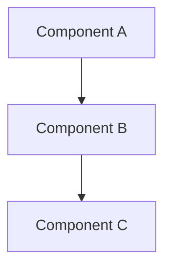
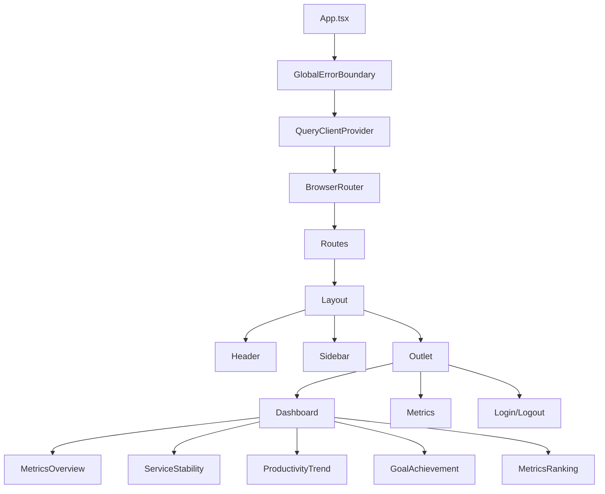

# Pull Request 작성 가이드

> **중요**: 모든 PR은 한글로 작성합니다.

이 문서는 변경 규모에 따른 상세한 PR 작성 가이드입니다. 기본 템플릿만 필요하다면 [pull_request_template.md](./pull_request_template.md)를 사용하세요.

## 목차

- [변경 규모 결정하기](#변경-규모-결정하기)
- [소규모 변경 PR](#소규모-변경-pr)
- [중규모 변경 PR](#중규모-변경-pr)
- [대규모 변경 PR](#대규모-변경-pr)
- [PR 작성 체크리스트](#pr-작성-체크리스트)
- [리뷰어를 위한 가이드](#리뷰어를-위한-가이드)

---

## 변경 규모 결정하기

PR을 작성하기 전, 변경 규모를 판단하세요:

| 규모 | 파일 수 | 변경 라인 수 | 커밋 수 | 예시 |
|------|---------|--------------|---------|------|
| **소규모** | 1-5개 | ~100 라인 | 1-2개 | 버그 수정, 작은 기능 추가, 문서 수정 |
| **중규모** | 5-15개 | 100-500 라인 | 2-5개 | 기능 추가, 리팩토링, 컴포넌트 개선 |
| **대규모** | 15개+ | 500+ 라인 | 5개+ | 새로운 모듈, 대규모 기능, 초기 설정 |

---

## 소규모 변경 PR

### 템플릿

```markdown
## 📌 변경 내용

<!-- 한 줄로 변경 내용 요약 -->
[컴포넌트/기능명]의 [문제]를 수정했습니다.

## 🐛 문제 상황

<!-- 무엇이 문제였나요? -->
- 문제 설명

## ✅ 해결 방법

<!-- 어떻게 해결했나요? -->
- 해결 방법 설명

## 📸 스크린샷 (선택)

### Before
<!-- 변경 전 -->

### After
<!-- 변경 후 -->

## 체크리스트

- [ ] 로컬 테스트 완료
- [ ] 빌드 성공 (`npm run build`)
- [ ] ESLint 통과 (`npm run lint`)
```

### 예시: 버그 수정

```markdown
## 📌 변경 내용

MetricsTable 컴포넌트의 타입 오류를 수정했습니다.

## 🐛 문제 상황

- MetricCategory enum을 import type으로 가져와서 런타임에 값으로 사용 불가
- TypeScript 빌드 오류 발생 (TS1361)

## ✅ 해결 방법

- import type 대신 일반 import로 변경
- enum 값을 직접 사용 (MetricCategory.CODE_QUALITY)

## 체크리스트

- [x] 로컬 테스트 완료
- [x] 빌드 성공 (`npm run build`)
- [x] ESLint 통과 (`npm run lint`)
```

---

## 중규모 변경 PR

### 템플릿

```markdown
## 📌 기능 설명

<!-- 변경된 기능이나 수정 내용을 간단히 설명 -->

## 👩‍💻 요구 사항과 구현 내용

### 요구 사항
<!-- 왜 이 변경이 필요했나요? -->

1. [요구사항 1]
2. [요구사항 2]

### 구현 내용
<!-- 어떻게 구현했나요? -->

1. [기능/화면명]
   - [구현 상세 1]
   - [구현 상세 2]

## 📂 변경된 파일

| 파일 | 변경 내용 |
|------|-----------|
| `파일명` | 설명 |

## 📸 스크린샷 (UI 변경이 있는 경우)

### Before
<!-- 변경 전 -->

### After
<!-- 변경 후 -->

## 🧪 테스트 계획

- [ ] 테스트 항목 1
- [ ] 테스트 항목 2

## 체크리스트

- [ ] 코드 리뷰 준비 완료
- [ ] 로컬에서 테스트 완료
- [ ] 빌드 성공 (`npm run build`)
- [ ] ESLint 통과 (`npm run lint`)
- [ ] TypeScript 타입 에러 없음
- [ ] 커밋 메시지 정리 완료
```

### 예시: 타입 시스템 개선

```markdown
## 📌 기능 설명

대시보드 목업 데이터에 TypeScript 타입 정의를 추가하여 타입 안정성을 강화했습니다.

## 👩‍💻 요구 사항과 구현 내용

### 요구 사항

1. 백엔드 MongoDB 스키마와 프론트엔드 타입 정의 일치 필요
2. API 연동 전 타입 오류 사전 방지
3. 코드 자동완성 및 타입 힌트 개선

### 구현 내용

1. **타입 정의 파일 생성**
   - companyQuality.types.ts: 전사 BDPI 품질 데이터
   - serviceStability.types.ts: 서비스 안정성 메트릭
   - productionTrend.types.ts: 개발생산성 트렌드
   - goalAchievement.types.ts: 목표 달성률
   - metricRankings.types.ts: 지표 순위

2. **목업 데이터 타입 적용**
   - MongoDB 스키마 기반 인터페이스 사용
   - 공통 속성 통일 (count/rate/hours → value)

## 📂 변경된 파일

| 파일 | 변경 내용 |
|------|-----------|
| `src/types/companyQuality.types.ts` | 신규 생성 |
| `src/types/serviceStability.types.ts` | 신규 생성 |
| `src/types/productionTrend.types.ts` | 신규 생성 |
| `src/types/goalAchievement.types.ts` | 신규 생성 |
| `src/types/metricRankings.types.ts` | 신규 생성 |
| `src/api/mocks/dashboard/*.mock.ts` | 타입 적용 |

## 체크리스트

- [x] 코드 리뷰 준비 완료
- [x] 로컬에서 테스트 완료
- [x] 빌드 성공 (`npm run build`)
- [x] ESLint 통과 (`npm run lint`)
- [x] TypeScript 타입 에러 없음
- [x] 커밋 메시지 정리 완료
```

---

## 대규모 변경 PR

### 템플릿

```markdown
## 📌 개요

<!-- PR의 전체적인 목적을 2-3문장으로 요약 -->

## 🎯 목표

<!-- 이 PR로 달성하고자 하는 목표 -->

- [ ] 목표 1
- [ ] 목표 2
- [ ] 목표 3

## 📦 주요 변경사항

### 1. [변경사항 카테고리 1]

**배경:**
<!-- 왜 필요했나요? -->

**구현 내용:**
<!-- 무엇을 했나요? -->

**파일 변경:**
| 파일 | 변경 내용 |
|------|-----------|
| `파일명` | 설명 |

---

### 2. [변경사항 카테고리 2]

**배경:**

**구현 내용:**

**파일 변경:**

---

## 🏗️ 아키텍처 변경 (있는 경우)

<!-- Mermaid 다이어그램으로 구조 표시 -->



## 📊 통계

- 변경된 파일: XX개
- 추가된 라인: +XXX
- 삭제된 라인: -XXX
- 커밋 수: XX개

## 📸 스크린샷

### [화면/기능 1]

**Before**
<!-- 변경 전 -->

**After**
<!-- 변경 후 -->

### [화면/기능 2]

**Before**

**After**

## 🧪 테스트 계획

### 기능 테스트
- [ ] 테스트 항목 1
- [ ] 테스트 항목 2
- [ ] 테스트 항목 3

### 통합 테스트
- [ ] 테스트 항목 1
- [ ] 테스트 항목 2

### 성능 테스트
- [ ] 빌드 시간 확인
- [ ] 번들 크기 확인

## 🔍 리뷰 포인트

<!-- 리뷰어가 특히 집중해서 봐야 할 부분 -->

1. **[카테고리 1]**: 설명
2. **[카테고리 2]**: 설명

## 📝 참고 사항

- 알려진 이슈:
- 향후 개선 계획:
- 관련 문서:

## 🔗 관련 이슈

- Closes #이슈번호
- 관련 Jira: [JIRA-XXX](링크)

## 체크리스트

### 코드 품질
- [ ] 코드 리뷰 준비 완료
- [ ] 빌드 성공 (`npm run build`)
- [ ] ESLint 통과 (`npm run lint`)
- [ ] TypeScript 타입 에러 없음

### 테스트
- [ ] 로컬 테스트 완료
- [ ] 크로스 브라우저 테스트 (Chrome, Firefox, Safari)
- [ ] 반응형 테스트 (모바일, 태블릿, 데스크톱)

### 문서
- [ ] README 업데이트 (필요시)
- [ ] 주석 및 문서화 완료
- [ ] 커밋 메시지 정리 완료
```

### 실제 예시: PR #1 - 프로젝트 초기 설정 및 대시보드 UI 구축

```markdown
## 📌 개요

Barcode Plus 프론트엔드 프로젝트의 기본 인프라를 구축하고, 대시보드 화면의 핵심 UI를 구현했습니다.
Okta 기반 인증 시스템, React Query를 활용한 데이터 페칭, Recharts 기반 차트 시스템을 포함합니다.

## 🎯 목표

- [x] 프로젝트 인프라 및 라이브러리 설정
- [x] 라우팅 구조 및 에러 처리 시스템 구축
- [x] Okta 기반 인증 시스템 구현
- [x] 대시보드 UI 컴포넌트 개발
- [x] 차트 컴포넌트 라이브러리 구축
- [x] 프로젝트 문서 작성

## 📦 주요 변경사항

### 1. 프로젝트 기본 인프라 설정

**배경:**
프로젝트의 기반이 되는 라이브러리와 개발 환경을 구성해야 했습니다.

**구현 내용:**
- **핵심 라이브러리 추가**
  - React Query: 서버 상태 관리 및 데이터 페칭
  - Axios: HTTP 클라이언트 설정
  - React Router DOM: 라우팅 시스템
  - Recharts: 차트 컴포넌트
  - Zustand: 클라이언트 상태 관리
- **프로젝트 구조 설정**
  - src/api/: API hooks 및 데이터 페칭 로직
  - src/libs/: 라이브러리 설정 (axios, react-query, chart)
  - src/types/: TypeScript 타입 정의
  - src/utils/: 유틸리티 함수 (에러 핸들러 등)
- **개발 환경 개선**
  - TypeScript path mapping (@/* → src/*)
  - .env 환경 변수 설정

**파일 변경:**
| 파일 | 변경 내용 |
|------|-----------|
| `package.json` | 라이브러리 의존성 추가 |
| `src/libs/axios/index.ts` | Axios 인터셉터 및 설정 |
| `src/libs/react-query/index.tsx` | React Query 설정 |
| `src/libs/chart/` | 차트 컴포넌트 라이브러리 |
| `tsconfig.app.json` | Path mapping 설정 |

---

### 2. 라우팅 구조 및 에러 처리 시스템

**배경:**
React Router 기반의 체계적인 라우팅 구조와 전역 에러 핸들링이 필요했습니다.

**구현 내용:**
- **라우팅 구조**
  - Layout 컴포넌트를 통한 중첩 라우팅 (Outlet 활용)
  - 페이지 컴포넌트 생성 (Dashboard, Login, Logout)
- **에러 처리**
  - GlobalErrorBoundary: React 렌더링 에러 캐치
  - react-hot-toast: API 에러 알림 시스템
  - 상태 코드별 토스트 스타일 차별화
- **로딩 처리**
  - Suspense 기반 로딩 화면

**파일 변경:**
| 파일 | 변경 내용 |
|------|-----------|
| `src/App.tsx` | Routes 및 중첩 라우팅 구조 |
| `src/components/error/GlobalErrorBoundary.tsx` | 신규 생성 |
| `src/components/layout/Layout.tsx` | 신규 생성 |
| `src/utils/errorHandler.ts` | 에러 핸들러 및 토스트 연동 |
| `src/env.ts` | 환경 변수 헬퍼 모듈 |

---

### 3. Okta 기반 인증 시스템

**배경:**
관리자 및 사용자 인증을 위한 Okta 연동이 필요했습니다.

**구현 내용:**
- **Okta 통합**
  - Admin/User별 Okta 설정 분리
  - 토큰 기반 인증 플로우
- **상태 관리**
  - Zustand를 활용한 인증 상태 관리
  - localStorage persist (개발 중 비활성화)
- **API 통합**
  - Axios 인터셉터에 토큰 자동 추가
  - 401 에러 처리 및 리다이렉트

**파일 변경:**
| 파일 | 변경 내용 |
|------|-----------|
| `src/api/auth.ts` | Okta 인증 API |
| `src/api/hooks/useAuth.ts` | 인증 관련 React Query hooks |
| `src/store/useAuthStore.ts` | Zustand 인증 스토어 |
| `src/pages/login/LoginPage.tsx` | 로그인 페이지 |

---

### 4. 대시보드 UI 시스템

**배경:**
품질 지표를 시각화하고 관리하기 위한 대시보드 화면이 필요했습니다.

**구현 내용:**
- **메인 대시보드**
  - 전사 BDPI 평균 (도넛 차트)
  - 코드 품질, 리뷰 품질, 개발 효율 메트릭
  - 서비스 안정성 지표 (배포 빈도, 성공률, MTTR, MTTD, 장애 건수)
  - 개발생산성 트렌드 (라인 차트)
  - 목표 달성률
  - 지표 순위 (우수/위험)
- **컴포넌트 구조**
  - 재사용 가능한 UI 컴포넌트 (Card, Button 등)
  - 대시보드 전용 컴포넌트 (MetricsOverview, ServiceStability 등)
- **목업 데이터**
  - 개발 중 API 없이 테스트 가능한 목업 데이터 구성

**파일 변경:**
| 파일 | 변경 내용 |
|------|-----------|
| `src/pages/dashboard/Dashboard.tsx` | 메인 대시보드 |
| `src/components/dashboard/*.tsx` | 대시보드 컴포넌트 (7개) |
| `src/components/ui/*.tsx` | 공통 UI 컴포넌트 |
| `src/api/mocks/dashboard/*.mock.ts` | 목업 데이터 |
| `src/styles/colors.ts` | 색상 시스템 |

---

### 5. 차트 컴포넌트 라이브러리

**배경:**
대시보드에서 사용할 다양한 차트 컴포넌트가 필요했습니다.

**구현 내용:**
- **차트 타입**
  - LineChart: 트렌드 표시 (점선 옵션 포함)
  - DonutChart: 비율 표시
  - AreaChart: 영역 차트
  - BarChart: 막대 차트
  - RadarChart: 레이더 차트
- **공통 설정**
  - 브랜드 색상 적용
  - 반응형 크기 조정
  - 툴팁 스타일링

**파일 변경:**
| 파일 | 변경 내용 |
|------|-----------|
| `src/libs/chart/components/*.tsx` | 차트 컴포넌트 (5개) |
| `src/libs/chart/config.ts` | 차트 공통 설정 |
| `src/libs/chart/README.md` | 차트 사용 가이드 |

---

### 6. 프로젝트 문서

**배경:**
팀원들이 프로젝트를 이해하고 기여할 수 있도록 문서화가 필요했습니다.

**구현 내용:**
- README.md: 프로젝트 소개, 시작 가이드, 구조 설명
- TAILWINDCSS_GUIDE.md: Tailwind CSS 사용 가이드
- 컴포넌트별 README: API hooks, libs 사용법

**파일 변경:**
| 파일 | 변경 내용 |
|------|-----------|
| `README.md` | 전체 프로젝트 문서 |
| `TAILWINDCSS_GUIDE.md` | 신규 생성 |
| `src/api/hooks/README.md` | API hooks 가이드 |
| `src/libs/README.md` | 라이브러리 사용 가이드 |

---

## 🏗️ 아키텍처



## 📊 통계

- **변경된 파일**: 82개
- **추가된 라인**: +5,443
- **삭제된 라인**: -111
- **커밋 수**: 14개

### 커밋 구성
1. 프로젝트 기본 인프라 및 라이브러리 설정
2. 라우팅 구조 및 에러 처리 시스템 구축
3. Okta 기반 인증 시스템 구현
4. Okta 인증 설정 개선
5. 홈화면 UI 컴포넌트 구성
6. 대시보드 메트릭 표시 개선 및 DonutChart 추가
7. 대시보드 UI 시스템 및 레이아웃 구축
8. 대시보드 목업 데이터 구조 개선
9. 프로젝트 README 문서 작성
10. LineChart 점선 스타일 옵션 추가
11. 코드 품질 개선 및 중복 제거
12. ESLint 자동 실행 및 빌드 검증 설정
13. ESLint 오류 및 TypeScript 빌드 오류 수정
14. localStorage persist 비활성화로 인증 보안 강화

## 📸 스크린샷

### 로그인 페이지

**After**
<!-- 로그인 화면 스크린샷 -->

### 대시보드

**After**
<!-- 대시보드 스크린샷 -->

## 🧪 테스트 계획

### 기능 테스트
- [x] 로그인/로그아웃 플로우
- [x] 대시보드 메트릭 표시
- [x] 차트 렌더링
- [x] 반응형 레이아웃
- [x] 에러 핸들링

### 통합 테스트
- [x] Okta 인증 연동
- [x] API 에러 토스트 표시
- [x] 라우팅 및 네비게이션

### 성능 테스트
- [x] 빌드 시간: ~4초
- [x] 번들 크기: ~647KB (gzip: ~198KB)

## 🔍 리뷰 포인트

1. **인증 시스템**: Okta 설정 및 토큰 관리 로직 검토
2. **컴포넌트 구조**: 재사용성 및 책임 분리 확인
3. **타입 정의**: TypeScript 타입 안정성 검토
4. **에러 처리**: 다양한 에러 상황 대응 확인
5. **코드 품질**: ESLint 규칙 준수 및 코드 스타일 통일성

## 📝 참고 사항

- **알려진 이슈**:
  - localStorage persist 기능은 개발 중 비활성화 (보안상 이유)
  - 일부 목업 데이터는 실제 API 연동 시 조정 필요

- **향후 개선 계획**:
  - 단위 테스트 추가 (Jest + Testing Library)
  - Storybook을 통한 컴포넌트 문서화
  - 실제 API 연동 및 목업 제거
  - 성능 최적화 (Code Splitting)

- **관련 문서**:
  - [README.md](../README.md)
  - [TAILWINDCSS_GUIDE.md](./TAILWINDCSS_GUIDE.md)
  - [COMMIT_MESSAGE_GUIDE.md](./COMMIT_MESSAGE_GUIDE.md)

## 🔗 관련 이슈

- 프로젝트 초기 설정 및 대시보드 UI 구축

## 체크리스트

### 코드 품질
- [x] 코드 리뷰 준비 완료
- [x] 빌드 성공 (`npm run build`)
- [x] ESLint 통과 (`npm run lint`)
- [x] TypeScript 타입 에러 없음

### 테스트
- [x] 로컬 테스트 완료
- [x] 크로스 브라우저 테스트 (Chrome)
- [x] 반응형 테스트 (데스크톱)

### 문서
- [x] README 작성
- [x] TAILWINDCSS_GUIDE 작성
- [x] 주석 및 문서화 완료
- [x] 커밋 메시지 정리 완료
```

---

## PR 작성 체크리스트

PR을 제출하기 전 다음 항목을 확인하세요:

### 📝 내용 작성
- [ ] 제목이 명확하고 간결한가?
- [ ] 변경 내용을 충분히 설명했는가?
- [ ] 배경과 목적을 명시했는가?
- [ ] 스크린샷을 첨부했는가? (UI 변경 시)

### 🔍 코드 품질
- [ ] 빌드가 성공하는가? (`npm run build`)
- [ ] ESLint 에러가 없는가? (`npm run lint`)
- [ ] TypeScript 타입 에러가 없는가?
- [ ] 불필요한 console.log가 없는가?
- [ ] 주석이 적절히 작성되었는가?

### 🧪 테스트
- [ ] 로컬에서 테스트했는가?
- [ ] 주요 브라우저에서 확인했는가?
- [ ] 반응형이 잘 작동하는가? (모바일, 태블릿, 데스크톱)
- [ ] 에러 상황을 테스트했는가?

### 📦 커밋
- [ ] 커밋 메시지가 [COMMIT_MESSAGE_GUIDE.md](./COMMIT_MESSAGE_GUIDE.md)를 따르는가?
- [ ] 커밋이 논리적으로 분리되어 있는가?
- [ ] 불필요한 파일이 포함되지 않았는가?

### 👥 리뷰 준비
- [ ] 리뷰어가 알아야 할 특별한 사항을 명시했는가?
- [ ] 관련 이슈나 Jira 티켓을 연결했는가?
- [ ] Draft PR로 먼저 올려 피드백을 받았는가? (대규모 변경)

---

## 리뷰어를 위한 가이드

### 리뷰 우선순위

1. **🔴 Critical (필수 수정)**
   - 보안 취약점
   - 성능 이슈
   - 기능 동작 오류
   - 타입 안정성 문제

2. **🟡 Important (권장 수정)**
   - 코드 구조 개선
   - 네이밍 컨벤션
   - 중복 코드 제거
   - 테스트 누락

3. **🟢 Minor (선택 수정)**
   - 스타일 가이드
   - 주석 개선
   - 문서화
   - 사소한 최적화

### 리뷰 코멘트 작성 예시

**좋은 예시:**
```
🔴 [Critical] 보안 취약점: API 키가 하드코딩되어 있습니다.
환경 변수로 분리해주세요.

파일: src/api/config.ts:15
제안: process.env.VITE_API_KEY 사용
```

```
🟡 [Important] 이 함수가 너무 복잡해 보입니다.
작은 함수로 분리하면 가독성이 좋아질 것 같습니다.

예시:
- validateInput()
- processData()
- formatOutput()
```

```
🟢 [Minor] 변수명을 더 명확하게 하면 좋겠습니다.
data → userMetrics
```

**피해야 할 코멘트:**
- ❌ "이거 이상한데요?" (구체적이지 않음)
- ❌ "제 스타일이 아닌데..." (주관적)
- ❌ "다시 짜세요" (건설적이지 않음)

### Approve 기준

다음 조건을 모두 만족하면 Approve:
- ✅ 기능이 정상 작동함
- ✅ 코드 품질이 프로젝트 표준을 충족함
- ✅ 테스트가 충분히 이루어짐
- ✅ 문서화가 적절함
- ✅ 성능이나 보안 이슈가 없음

---

## 💡 팁

### 1. PR은 작게, 자주
- 큰 기능은 여러 개의 작은 PR로 나누기
- 리뷰 시간 단축 및 피드백 반영 용이

### 2. Draft PR 활용
- 작업 중인 코드를 Draft PR로 먼저 공유
- 방향성에 대한 초기 피드백 받기

### 3. 자기 리뷰 먼저
- PR을 올리기 전 직접 한 번 리뷰
- 불필요한 변경사항 제거

### 4. 리뷰어 배려
- 변경 내용을 명확히 설명
- 리뷰 포인트를 명시
- 충분한 컨텍스트 제공

### 5. 피드백 수용
- 모든 코멘트에 응답
- 건설적인 토론
- 배우는 자세

---

**마지막 업데이트:** 2025-11-06
