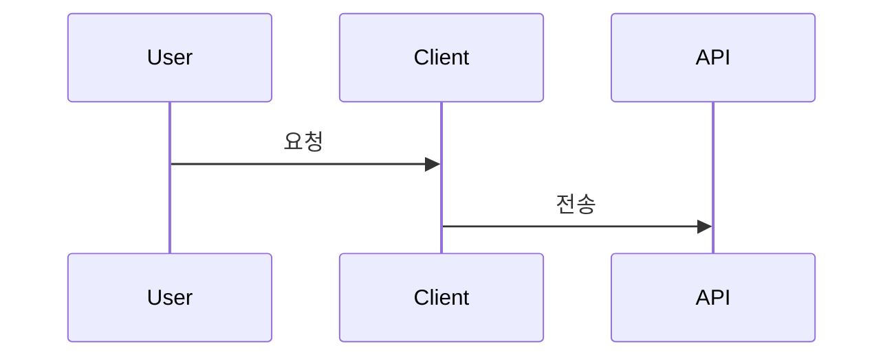

# 예시 모음

이 디렉토리에는 프로젝트의 실제 커밋 및 PR 히스토리를 바탕으로 작성된 모범 예시들이 있습니다.

## 📋 예시 목록

### 커밋 메시지 예시

| 파일 | 타입 | 설명 | 난이도 |
|------|------|------|--------|
| [commit-message-feat-routing.md](./commit-message-feat-routing.md) | `feat` | 라우팅 구조 및 에러 처리 시스템 구축 | ⭐⭐⭐ 복잡 |
| [commit-message-fix-typescript.md](./commit-message-fix-typescript.md) | `fix` | TypeScript 빌드 오류 수정 | ⭐⭐ 중간 |
| [commit-message-refactor-types.md](./commit-message-refactor-types.md) | `refactor` | 대시보드 목업 데이터 타입 정의 추가 | ⭐⭐ 중간 |

### Pull Request 템플릿

| 파일 | 규모 | 설명 |
|------|------|------|
| [large_pr_template.md](./large_pr_template.md) | 대규모 | 15개 이상 파일, 500+ 라인 변경 시 사용 |

## 📚 학습 가이드

### 1. feat (기능 추가) 예시 살펴보기
**파일**: `commit-message-feat-routing.md`

**배울 점:**
- 여러 기능을 하나의 논리적 단위로 묶는 방법
- 서브섹션을 활용한 체계적인 설명 구조
- 라이브러리 추가 시 설명 방법

**적합한 경우:**
- 새로운 기능을 추가할 때
- 여러 파일을 수정하지만 하나의 목적을 가질 때
- 라이브러리나 의존성 추가가 포함될 때

### 2. fix (버그 수정) 예시 살펴보기
**파일**: `commit-message-fix-typescript.md`

**배울 점:**
- 문제 상황을 명확히 기술하는 방법
- 변경 전/후 코드 비교 방식
- 테이블을 활용한 다중 변경사항 정리
- 빌드 결과로 검증 표시

**적합한 경우:**
- 빌드 오류나 런타임 에러를 수정할 때
- 타입 오류를 해결할 때
- 여러 파일에 걸친 연관된 버그를 수정할 때

### 3. refactor (리팩토링) 예시 살펴보기
**파일**: `commit-message-refactor-types.md`

**배울 점:**
- 리팩토링 배경 설명하는 방법
- 설계 원칙 문서화 방법
- 개선 효과를 정량화하여 표현
- 테이블을 활용한 변경 파일 정리

**적합한 경우:**
- 타입 정의나 인터페이스를 개선할 때
- 코드 구조를 변경하지만 기능은 동일할 때
- 설계 원칙에 따라 코드를 정리할 때

## 🎯 커밋 메시지 작성 체크리스트

커밋 메시지 작성 전 다음 항목을 확인하세요:

### 제목 (Subject)
- [ ] 적절한 타입 접두사 사용 (`feat`, `fix`, `refactor` 등)
- [ ] 50자 이내로 작성
- [ ] 마침표 없이 작성
- [ ] 한글로 작성
- [ ] 변경 사항을 명확히 설명

### 본문 (Body)
- [ ] 변경 사항을 `-`로 구분하여 나열
- [ ] 무엇을, 왜 변경했는지 설명
- [ ] 3~7개 항목으로 요약

### 상세 설명
- [ ] `# 상세 설명` 섹션 포함
- [ ] 서브섹션 (`##`)으로 논리적 구분
- [ ] 필요시 코드 예시 포함
- [ ] 복잡한 변경은 테이블이나 다이어그램 활용
- [ ] 배경이나 이유 설명 포함

## 💡 작성 팁

### 1. 변경 사항이 많을 때
**테이블 형식 활용**
```markdown
| 파일 | 변경 내용 |
|------|-----------|
| `Dashboard.tsx` | 메인 로직 분리 |
| `MetricsCard.tsx` | 신규 생성 |
```

### 2. 플로우나 프로세스 변경 시
**Mermaid 다이어그램 활용**
```markdown

\`\`\`
```

### 3. 코드 변경이 명확할 때
**변경 전/후 비교**
```markdown
**변경 전:**
\`\`\`typescript
const count = data.count;
\`\`\`

**변경 후:**
\`\`\`typescript
const count = data.value;
\`\`\`

**이유:** 속성명 통일
```

### 4. 대규모 PR 작성법 살펴보기
**파일**: `large_pr_template.md`

**배울 점:**
- 대규모 변경사항을 체계적으로 정리하는 방법
- 카테고리별로 변경사항을 그룹화하는 방법
- Mermaid 다이어그램을 활용한 아키텍처 설명
- 통계 및 커밋 구성 정리 방법
- 상세한 테스트 계획 작성

**적합한 경우:**
- 15개 이상의 파일 변경
- 500 라인 이상의 코드 변경
- 5개 이상의 커밋 포함
- 프로젝트 초기 설정이나 대규모 리팩토링

## 🔗 관련 문서

- [COMMIT_MESSAGE_GUIDE.md](../COMMIT_MESSAGE_GUIDE.md) - 커밋 메시지 작성 규칙
- [PULL_REQUEST_GUIDE.md](../PULL_REQUEST_GUIDE.md) - Pull Request 작성 가이드
- [프로젝트 README](../../README.md) - 프로젝트 전체 문서

## ⚠️ 주의사항

이 디렉토리의 파일들은 `.gitignore`에 포함되어 있어 Git에 추적되지 않습니다.
팀원과 공유하지 않고 개인 학습용으로 사용하세요.

---

**마지막 업데이트:** 2025-11-06
