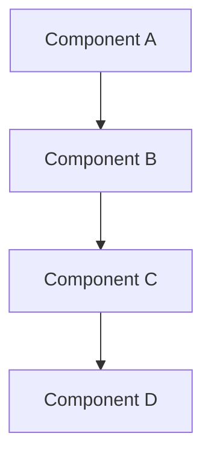

# 대규모 변경 PR 템플릿

> 이 템플릿은 15개 이상의 파일이 변경되거나, 500 라인 이상의 변경, 5개 이상의 커밋을 포함하는 대규모 PR을 위한 것입니다.

---

## 📌 개요

<!-- PR의 전체적인 목적을 2-3문장으로 요약 -->
<!-- 예: "이 PR은 프로젝트의 기본 인프라를 구축하고 대시보드 핵심 UI를 구현합니다." -->

## 🎯 목표

<!-- 이 PR로 달성하고자 하는 목표 -->

- [ ] 목표 1
- [ ] 목표 2
- [ ] 목표 3

---

## 📦 주요 변경사항

### 1. [변경사항 카테고리 1]

**배경:**
<!-- 왜 이 변경이 필요했나요? -->

**구현 내용:**
<!-- 무엇을 구현했나요? -->
- 구현 항목 1
- 구현 항목 2

**파일 변경:**
| 파일 | 변경 내용 |
|------|-----------|
| `파일명` | 설명 |
| `파일명` | 설명 |

---

### 2. [변경사항 카테고리 2]

**배경:**

**구현 내용:**

**파일 변경:**

---

### 3. [변경사항 카테고리 3]

**배경:**

**구현 내용:**

**파일 변경:**

---

## 🏗️ 아키텍처 변경 (있는 경우)

<!-- Mermaid 다이어그램으로 구조 표시 -->

**설명:**
<!-- 아키텍처 변경에 대한 추가 설명 -->

---

## 📊 통계

- **변경된 파일**: XX개
- **추가된 라인**: +XXX
- **삭제된 라인**: -XXX
- **커밋 수**: XX개

### 커밋 구성
<!-- 주요 커밋들을 시간순으로 나열 -->
1. [커밋 메시지 1]
2. [커밋 메시지 2]
3. [커밋 메시지 3]
...

---

## 📸 스크린샷

### [화면/기능 1]

**Before**
<!-- 변경 전 스크린샷 또는 "해당 없음" -->

**After**
<!-- 변경 후 스크린샷 -->

---

### [화면/기능 2]

**Before**

**After**

---

## 🧪 테스트 계획

### 기능 테스트
- [ ] 기능 1 동작 확인
- [ ] 기능 2 동작 확인
- [ ] 기능 3 동작 확인
- [ ] 에러 케이스 처리 확인

### 통합 테스트
- [ ] 다른 모듈과의 연동 확인
- [ ] API 통신 정상 동작
- [ ] 인증/권한 처리 확인

### 성능 테스트
- [ ] 빌드 시간 확인
- [ ] 번들 크기 확인 (기존 대비 증가율)
- [ ] 페이지 로딩 시간 측정

### 브라우저 테스트
- [ ] Chrome
- [ ] Firefox
- [ ] Safari
- [ ] Edge

### 반응형 테스트
- [ ] 모바일 (375px~)
- [ ] 태블릿 (768px~)
- [ ] 데스크톱 (1024px~)

---

## 🔍 리뷰 포인트

<!-- 리뷰어가 특히 집중해서 봐야 할 부분 -->

1. **[카테고리 1]**:
   - 구체적인 리뷰 포인트 설명
   - 주의해서 봐야 할 부분

2. **[카테고리 2]**:
   - 구체적인 리뷰 포인트 설명

3. **[카테고리 3]**:
   - 구체적인 리뷰 포인트 설명

---

## 📝 참고 사항

### 알려진 이슈
<!-- 현재 알려진 문제나 제약사항 -->
- 이슈 1: 설명 및 향후 계획
- 이슈 2: 설명 및 향후 계획

### 향후 개선 계획
<!-- 이번 PR에는 포함되지 않았지만 향후 개선할 사항 -->
- 개선 1: 설명
- 개선 2: 설명

### 관련 문서
<!-- 참고할 만한 문서 링크 -->
- [README.md](../../README.md)
- [COMMIT_MESSAGE_GUIDE.md](../COMMIT_MESSAGE_GUIDE.md)
- [기타 관련 문서]

### 기술적 부채
<!-- 이번 PR로 인해 발생한 기술적 부채 (있다면) -->
- 부채 1: 설명 및 해결 계획
- 부채 2: 설명 및 해결 계획

---

## 🔗 관련 이슈

- Closes #이슈번호
- 관련 Jira: [JIRA-XXX](링크)
- 관련 PR: #PR번호

---

## ✅ 체크리스트

### 코드품질
- [ ] 코드 리뷰 준비 완료
- [ ] 빌드 성공 (`npm run build`)
- [ ] ESLint 통과 (`npm run lint`)
- [ ] TypeScript 타입 에러 없음
- [ ] 불필요한 console.log 제거
- [ ] 주석 및 문서화 완료

### 테스트
- [ ] 로컬 테스트 완료
- [ ] 크로스 브라우저 테스트 완료
- [ ] 반응형 테스트 완료
- [ ] 에러 케이스 테스트 완료
- [ ] 성능 테스트 완료

### 문서
- [ ] README 업데이트 (필요시)
- [ ] API 문서 업데이트 (필요시)
- [ ] 컴포넌트 문서 작성 (필요시)
- [ ] 커밋 메시지 정리 완료 ([COMMIT_MESSAGE_GUIDE.md](../COMMIT_MESSAGE_GUIDE.md) 참고)

### 보안 및 성능
- [ ] 환경 변수 하드코딩 없음
- [ ] 민감 정보 노출 없음
- [ ] 번들 크기 확인 (과도한 증가 없음)
- [ ] 메모리 누수 확인

### 배포 준비
- [ ] 환경별 설정 확인 (dev, staging, prod)
- [ ] 마이그레이션 스크립트 준비 (필요시)
- [ ] 롤백 계획 수립 (필요시)

---

## 💬 추가 노트

<!-- 리뷰어에게 전달하고 싶은 추가 정보 -->
<!-- 예: 특정 부분에 대한 설명, 대안 검토 내용, 의사결정 배경 등 -->

---

**작성자:** @username
**작성일:** YYYY-MM-DD
**예상 리뷰 시간:** XX 시간

---

## 📚 참고 자료

더 자세한 가이드는 [PULL_REQUEST_GUIDE.md](../PULL_REQUEST_GUIDE.md)를 참고하세요.
