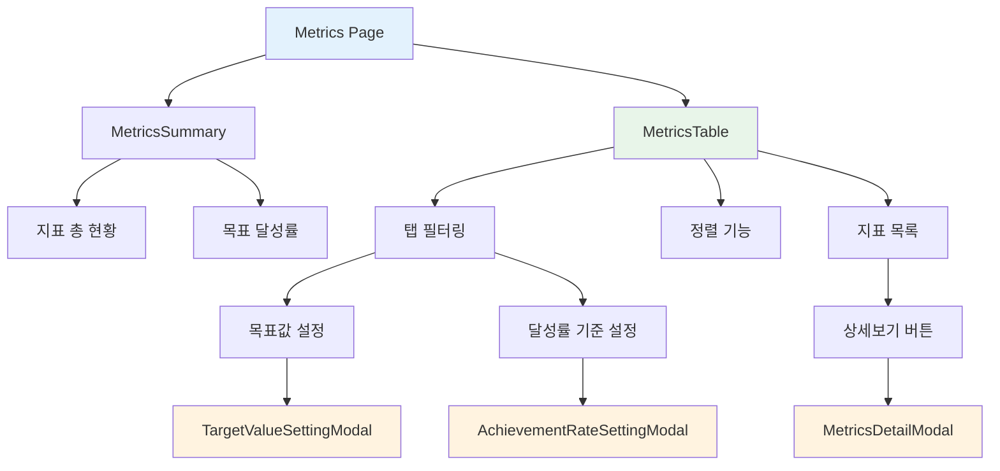
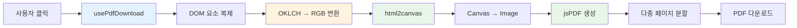

## 📌 개요

대시보드 UI 개선과 지표 관리 페이지를 구현했습니다. PDF 다운로드 기능, 지표 테이블 정렬 및 필터링, 모달 기반 설정 관리, 새로운 색상 시스템 적용을 포함합니다.

## 🎯 목표

- [x] 지표 관리 페이지 UI 구현
- [x] 대시보드 PDF 다운로드 기능 추가
- [x] Color Palette 3 색상 체계 전면 적용
- [x] 차트 시스템 개선 및 통합
- [x] 프로젝트 문서화 시스템 구축

## 📦 주요 변경사항

### 1. 지표 관리 페이지 구현

**배경:**
개발 품질 지표를 체계적으로 관리하고 시각화하기 위한 전용 페이지가 필요했습니다.

**구현 내용:**
- **지표 테이블 시스템**
  - 30개 지표를 카테고리별로 분류 (코드품질 9개, 리뷰품질 12개, 개발품질 9개)
  - 탭 기반 필터링 (전체/코드품질/리뷰품질/개발품질)
  - 비율 컬럼 정렬 기능 (오름차순/내림차순/정렬 없음)
  - 동적 테이블 높이 계산 (탭별 데이터 개수에 따라 자동 조정)
  - 단위 표시 및 한글화 (일, 개, %, h, /KLOC 등)
- **모달 시스템**
  - 지표 상세보기: 지표별 상세 정보 및 히스토리 표시
  - 목표값 설정: 지표별 목표값 수정
  - 달성률 기준 설정: 우수/경고/위험 기준값 관리
- **상태 관리**
  - Zustand 기반 useMetricsStore 구현
  - 탭 상태, 모달 열림/닫힘 상태, 선택된 지표 관리
- **UI 컴포넌트**
  - Tooltip 컴포넌트: React Portal 기반으로 테이블 overflow 문제 해결
  - MetricsSummary: 지표 총 현황 및 목표 달성률 표시
  - 아이콘 기반 상태 표시 (Excellent/Warning)

**파일 변경:**
| 파일 | 변경 내용 |
|------|-----------|
| `src/pages/metrics/Metrics.tsx` | 지표 관리 메인 페이지 구현 (+122 라인) |
| `src/components/metrics/MetricsTable.tsx` | 지표 테이블 컴포넌트 (신규 생성, 312 라인) |
| `src/components/metrics/MetricsSummary.tsx` | 지표 요약 컴포넌트 (신규 생성, 60 라인) |
| `src/components/metrics/MetricsDetailModal.tsx` | 지표 상세보기 모달 (신규 생성, 173 라인) |
| `src/components/metrics/TargetValueSettingModal.tsx` | 목표값 설정 모달 (신규 생성, 150 라인) |
| `src/components/metrics/AchievementRateSettingModal.tsx` | 달성률 기준 설정 모달 (신규 생성, 239 라인) |
| `src/store/useMetricsStore.ts` | 지표 관리 상태 관리 (신규 생성, 101 라인) |
| `src/mocks/metrics.mock.ts` | 지표 목업 데이터 (신규 생성, 400 라인) |
| `src/types/metrics.types.ts` | 지표 타입 정의 (신규 생성, 75 라인) |
| `src/utils/metrics.ts` | 지표 유틸리티 함수 (신규 생성, 177 라인) |

---

### 2. 대시보드 PDF 다운로드 기능

**배경:**
대시보드 데이터를 외부에 공유하거나 보고서로 활용하기 위한 PDF 다운로드 기능이 필요했습니다.

**구현 내용:**
- **PDF 생성 시스템**
  - html2canvas + jsPDF를 활용한 DOM to PDF 변환
  - A4 landscape 포맷 (297x210mm)
  - 다중 페이지 지원 (컨텐츠 높이에 따라 자동 페이지 분할)
- **색상 변환 로직**
  - html2canvas가 Tailwind CSS v4의 oklch 색상 파싱 불가 문제 해결
  - OKLCH → Linear RGB → sRGB 수학적 변환 구현
  - 복제된 DOM에서 모든 color 속성을 RGB로 변환 후 캡처
  - 지원 속성: color, backgroundColor, borderColor, outlineColor, fill, stroke
- **Custom Hook**
  - usePdfDownload: PDF 생성 상태 및 다운로드 함수 제공
  - isGenerating 상태로 로딩 UI 제어

**알려진 제약사항:**
- SVG 내부 텍스트 위치가 html2canvas에서 올바르게 렌더링되지 않는 문제
- dominant-baseline 속성을 html2canvas가 지원하지 않아 도넛차트의 중앙 텍스트 위치 오차 발생
- 여러 해결 시도 (dy/transform/y 좌표 조정) 모두 실패하여 현재는 알려진 제약사항으로 문서화

**파일 변경:**
| 파일 | 변경 내용 |
|------|-----------|
| `src/hooks/usePdfDownload.ts` | PDF 다운로드 Hook (신규 생성, 196 라인) |
| `src/pages/dashboard/Dashboard.tsx` | PDF 다운로드 버튼 및 기능 통합 |
| `package.json` | html2canvas, jspdf 라이브러리 추가 |

---

### 3. Color Palette 3 색상 체계 전면 적용

**배경:**
프로젝트의 색상 시스템을 통일하고 일관성 있는 UI를 구축하기 위해 새로운 색상 팔레트를 도입했습니다.

**구현 내용:**
- **색상 시스템 정의**
  - 5단계 그라데이션 시스템 (100-900)
  - 카테고리별 색상 (Primary, Success, Warning, Danger, Info 등)
  - Tailwind CSS v4 oklch 색상 포맷 사용
- **차트 색상 통합**
  - CHART_COLORS 객체로 차트 색상 중앙 관리
  - LINE_COLORS, PIE_COLORS, RADAR_COLORS 등 차트 타입별 색상 배열
  - 모든 차트 컴포넌트에 새로운 색상 체계 적용
- **컴포넌트 색상 업데이트**
  - Dashboard, ServiceStability, ProductivityTrend 등 주요 컴포넌트
  - Button 컴포넌트 variant 시스템 개선
  - 상태별 색상 구분 (Excellent/Warning/Danger)

**파일 변경:**
| 파일 | 변경 내용 |
|------|-----------|
| `src/styles/colors.ts` | 색상 시스템 전면 개편 (+38/-12 라인) |
| `src/libs/chart/config.ts` | 차트 색상 설정 통합 |
| `src/libs/chart/components/*.tsx` | 모든 차트 컴포넌트 색상 적용 |
| `src/components/dashboard/*.tsx` | 대시보드 컴포넌트 색상 업데이트 |
| `src/components/ui/Button.tsx` | Button variant 시스템 개선 |

---

### 4. 차트 시스템 개선 및 통합

**배경:**
다양한 차트 컴포넌트의 스타일 일관성과 재사용성을 높이기 위한 개선이 필요했습니다.

**구현 내용:**
- **LineChart 개선**
  - 다중 라인 지원 (최대 3개)
  - 라인별 점선/실선 스타일 옵션
  - 범례 표시 옵션
  - CartesianGrid 스타일 통일
- **DonutChart 개선**
  - 중앙 텍스트 포맷팅 개선
  - 반응형 크기 조정
- **차트 설정 중앙화**
  - CHART_CONFIG 객체로 공통 설정 관리
  - 툴팁 스타일, 그리드 스타일 통일
  - 반응형 너비 설정 (100%)

**파일 변경:**
| 파일 | 변경 내용 |
|------|-----------|
| `src/libs/chart/components/LineChart.tsx` | 다중 라인 및 스타일 옵션 추가 |
| `src/libs/chart/components/DonutChart.tsx` | 중앙 텍스트 개선 |
| `src/libs/chart/config.ts` | 차트 공통 설정 중앙화 |

---

### 5. 공통 컴포넌트 개선

**배경:**
재사용 가능한 UI 컴포넌트의 품질과 기능을 향상시켜야 했습니다.

**구현 내용:**
- **Tooltip 컴포넌트**
  - React Portal 기반 렌더링으로 overflow 문제 해결
  - getBoundingClientRect()로 정확한 위치 계산
  - fixed positioning으로 스크롤 무관 표시
- **DateFilter 컴포넌트**
  - dashboard 전용에서 공통 컴포넌트로 이동
  - src/components/ui/DateFilter.tsx로 재배치
  - 다중 페이지에서 재사용 가능
- **Button 컴포넌트**
  - variant 시스템 개선 (primary/secondary/ghost 등)
  - size 옵션 추가 (sm/md/lg)
  - 색상 체계 통합

**파일 변경:**
| 파일 | 변경 내용 |
|------|-----------|
| `src/components/ui/Tooltip.tsx` | Portal 기반으로 전면 개편 (신규 생성, 78 라인) |
| `src/components/ui/DateFilter.tsx` | 공통 컴포넌트로 이동 |
| `src/components/ui/Button.tsx` | variant 시스템 개선 |

---

### 6. 프로젝트 문서화 시스템 구축

**배경:**
팀원들이 프로젝트의 코드 작성 규칙과 가이드를 쉽게 참고할 수 있도록 체계적인 문서화가 필요했습니다.

**구현 내용:**
- **가이드 문서 작성**
  - COMMIT_MESSAGE_GUIDE.md: 커밋 메시지 작성 규칙 및 예시
  - PULL_REQUEST_GUIDE.md: PR 작성 규칙 및 변경 규모별 템플릿
  - UTILS_GUIDE.md: 유틸리티 함수 작성 가이드
  - TAILWINDCSS_GUIDE.md: Tailwind CSS 사용 가이드 업데이트
- **예시 문서**
  - .github/examples/ 디렉토리에 실제 예시 제공
  - 커밋 메시지 예시 (feat, fix, refactor)
  - Large PR 템플릿 예시
- **중앙화**
  - 모든 가이드를 .github/ 디렉토리로 통합
  - README.md에서 가이드 링크 제공

**파일 변경:**
| 파일 | 변경 내용 |
|------|-----------|
| `.github/COMMIT_MESSAGE_GUIDE.md` | 신규 생성, 191 라인 |
| `.github/PULL_REQUEST_GUIDE.md` | 신규 생성, 758 라인 |
| `.github/UTILS_GUIDE.md` | 신규 생성, 394 라인 |
| `.github/examples/*.md` | 예시 문서 5개 추가 |
| `README.md` | 문서 링크 업데이트 |

---

### 7. 타입 시스템 강화

**배경:**
백엔드 API 연동을 대비하여 타입 안정성을 강화하고 코드 자동완성을 개선해야 했습니다.

**구현 내용:**
- **타입 정의 파일 추가**
  - metrics.types.ts: 지표 관리 전용 타입
  - companyQuality.types.ts, serviceStability.types.ts 등 대시보드 타입
- **목업 데이터 타입 적용**
  - 모든 목업 데이터에 타입 명시
  - 일관된 데이터 구조 사용
- **유틸리티 함수 타입 지정**
  - metrics.ts의 모든 함수에 타입 명시
  - 타입 가드 함수 추가

**파일 변경:**
| 파일 | 변경 내용 |
|------|-----------|
| `src/types/metrics.types.ts` | 신규 생성, 75 라인 |
| `src/types/companyQuality.types.ts` | 타입 추가 |
| `src/types/serviceStability.types.ts` | 타입 추가 |
| `src/mocks/*.mock.ts` | 목업 데이터 타입 적용 |

---

## 🏗️ 아키텍처

### 지표 관리 페이지 구조

### PDF 다운로드 플로우

## 📊 통계

- **변경된 파일**: 66개
- **추가된 라인**: +5,015
- **삭제된 라인**: -275
- **커밋 수**: 20개

### 커밋 구성
1. 지표 관리 화면 UI 구현 및 차트 컴포넌트 개선
2. DateFilter 컴포넌트 공통 컴포넌트로 변경
3. 대시보드 홈 목업 데이터 타입 정의 추가
4. TypeScript 빌드 오류 수정
5. 가이드 문서 중앙화 및 문서화 시스템 구축
6. 대시보드 서비스 안정성 컴포넌트 UI 개선
7. 지표 관리 화면 UI 개선 및 Tooltip 컴포넌트 추가
8. 지표 관리 페이지 상태 관리 개선 및 설정 모달 구현
9. 대시보드 카드 컴포넌트 높이 속성 개선
10. 지표 관리 페이지 모달 애니메이션 및 데이터 구조 개선
11. Color Palette 3 색상 체계 전면 적용 및 차트 시스템 통합
12. 차트 색상 시스템 구조 개선 및 중복 컴포넌트 통합
13. 지표 상세보기 모달 추가 및 유틸리티 함수 구조 개선
14. Button 컴포넌트 및 색상 시스템 구조 개선
15. 대시보드 PDF 다운로드 및 지표 테이블 UX 개선
16. build 오류 수정
17. 지표 테이블에 단위 표시 추가 및 단위 한글화

## 📸 스크린샷

### 지표 관리 페이지

**지표 테이블 및 탭 필터링**
<!-- 지표 관리 페이지 메인 화면 -->

**목표값 설정 모달**
<!-- 목표값 수정 모달 화면 -->

**달성률 기준 설정 모달**
<!-- 달성률 기준 설정 화면 -->

**지표 상세보기 모달**
<!-- 지표 상세 정보 화면 -->

### 대시보드

**PDF 다운로드 기능**
<!-- PDF 다운로드 버튼 및 결과물 -->

**Color Palette 3 적용**
<!-- 새로운 색상 체계가 적용된 대시보드 -->

## 🧪 테스트 계획

### 기능 테스트
- [ ] 지표 관리 페이지
  - [ ] 탭 필터링 (전체/코드품질/리뷰품질/개발품질)
  - [ ] 비율 정렬 (오름차순/내림차순/정렬 없음)
  - [ ] 지표 상세보기 모달 열기/닫기
  - [ ] 목표값 설정 모달 열기/수정
  - [ ] 달성률 기준 설정 모달 열기/수정
- [ ] PDF 다운로드
  - [ ] 대시보드 전체 캡처
  - [ ] 다중 페이지 생성
  - [ ] 색상 정확도 확인
  - [ ] 다운로드 완료

### 통합 테스트
- [ ] Tooltip이 테이블 경계 밖에서 정상 표시
- [ ] 동적 테이블 높이가 탭별로 정확히 계산
- [ ] 모달 애니메이션 및 상태 관리 정상 동작
- [ ] 차트 색상이 모든 컴포넌트에서 일관되게 표시

### 성능 테스트
- [ ] 빌드 시간 확인
- [ ] 번들 크기 확인
- [ ] PDF 생성 시간 (대용량 컨텐츠)

## 🔍 리뷰 포인트

1. **PDF 다운로드 구현**: OKLCH to RGB 변환 로직의 정확성 검토
2. **Tooltip Portal 구현**: 위치 계산 및 렌더링 최적화 확인
3. **타입 정의**: metrics.types.ts의 타입 구조 및 일관성 검토
4. **색상 시스템**: Color Palette 3 적용의 일관성 및 접근성 확인
5. **컴포넌트 구조**: 지표 관리 페이지의 재사용성 및 확장성 검토
6. **상태 관리**: useMetricsStore와 useDashboardStore의 구조 및 역할 분리 확인

## 📝 참고 사항

- **알려진 이슈**:
  - PDF 다운로드 시 SVG 텍스트 위치가 약간 어긋나는 현상 (html2canvas의 dominant-baseline 미지원)
  - 도넛차트 중앙 텍스트의 세로 정렬이 PDF에서 정확하지 않을 수 있음

- **향후 개선 계획**:
  - 실제 API 연동 (현재 목업 데이터 사용)
  - 지표 히스토리 차트 구현
  - PDF 다운로드 SVG 텍스트 위치 문제 해결 (canvas 라이브러리 교체 검토)
  - 단위 테스트 추가
  - 반응형 모바일 레이아웃 최적화

- **관련 문서**:
  - [COMMIT_MESSAGE_GUIDE.md](./.github/COMMIT_MESSAGE_GUIDE.md)
  - [PULL_REQUEST_GUIDE.md](./.github/PULL_REQUEST_GUIDE.md)
  - [UTILS_GUIDE.md](./.github/UTILS_GUIDE.md)
  - [TAILWINDCSS_GUIDE.md](./.github/TAILWINDCSS_GUIDE.md)

## 🔗 관련 이슈

- 대시보드 UI 개선 및 지표 관리 기능 구현

## 체크리스트

### 코드 품질
- [x] 코드 리뷰 준비 완료
- [x] 빌드 성공 (`npm run build`)
- [x] ESLint 통과 (`npm run lint`)
- [x] TypeScript 타입 에러 없음

### 테스트
- [x] 로컬 테스트 완료
- [ ] 크로스 브라우저 테스트 (Chrome, Firefox, Safari)
- [ ] 반응형 테스트 (데스크톱 우선, 모바일은 향후 개선)

### 문서
- [x] 가이드 문서 작성 완료
- [x] 주석 및 문서화 완료
- [x] 커밋 메시지 정리 완료

---

🤖 Generated with [Claude Code](https://claude.com/claude-code)
